# Project Topic: Adding and editing firewall rules in Amazon Lightsail
## Step 1. Add and edit an instance firewall rule
 Sign in to the Lightsail console. 
 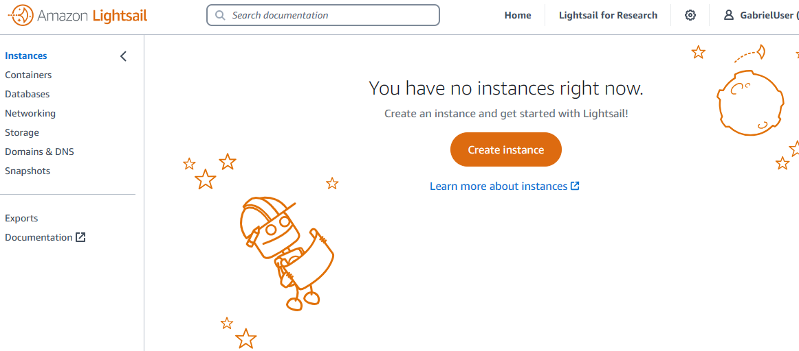

  On the Lightsail homepage, choose the Instances tab.
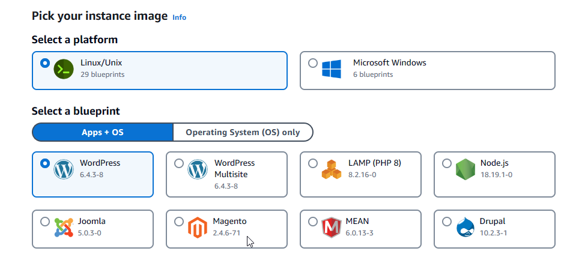

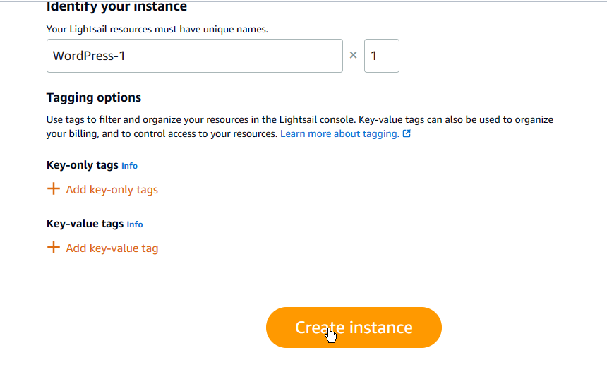

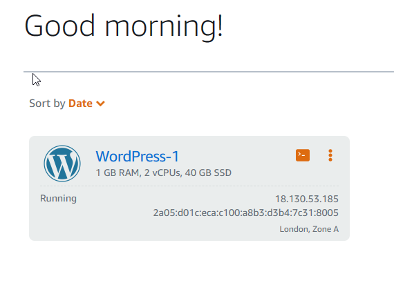

The Networking tab displays your instance's public and private IP addresses, and the configured firewall rules for your instance.

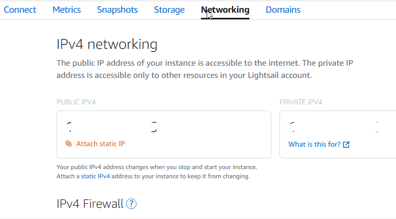

You can also choose Edit (pencil icon) next to an existing rule to edit it.

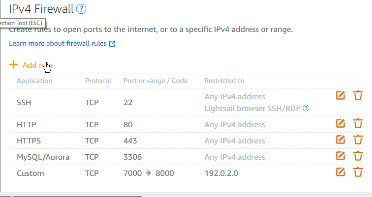

When you choose an application layer protocol type, a set of protocol and port presets are specified for you. Example values are Custom rule, All TCP, All UDP, SSH, and RDP.

If you choose the Custom rule option, then you can enter a single port number or range of port numbers (for example, 7000-8000) in the Port field.

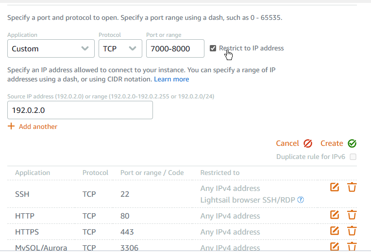

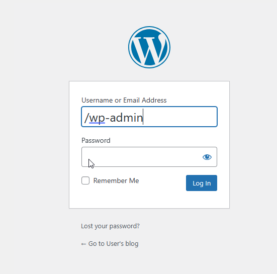

## Step 2. Deleting instance firewall rules
Complete the following steps to delete instance firewalls rule in the Lightsail console.
a. Sign in to the Lightsail console. 

b. On the Lightsail home page, choose the Instances tab

Choose the name of the instance for which you want to delete a firewall rule.

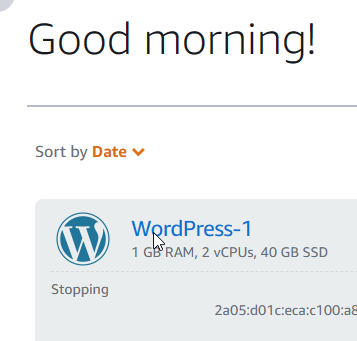

Choose the Networking tab on your instance's management page.

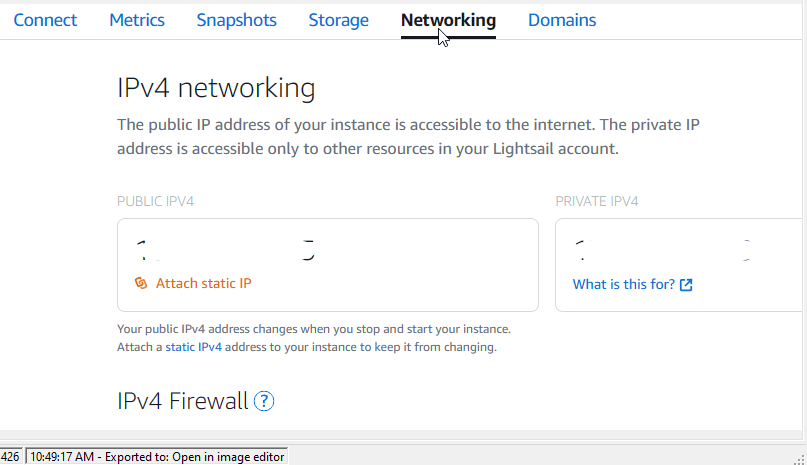

e. Scroll down to the Firewall section of the page, and choose Delete (the trash icon) next to an existing rule to delete it.
 
The firewall rule is deleted after a few moments.
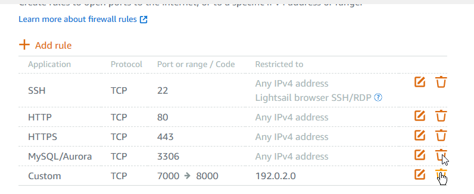
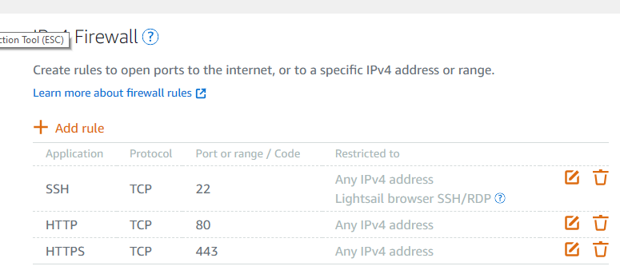

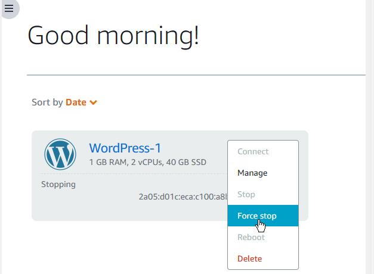

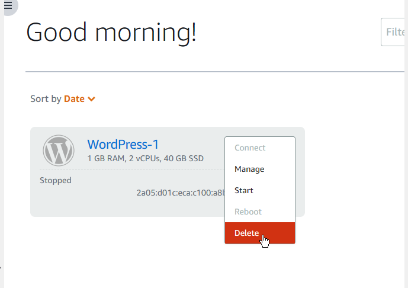

# Congratulations
You have added, edited, and deleted firewall rules for an Amazon Lightsail instance. 

Amazon Lightsail is a great choice to develop, build, and deploy a variety of applications like WordPress, websites, and blog platforms.

OLADIMJI (G) AKINTADE >>> AWS Cloud Club Unilag Chapter